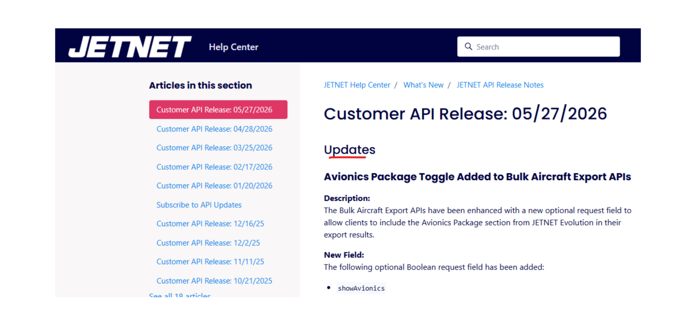

# Weekly Progress Report — Week 12
**Date Range:** Jun 1, 2026 — Jun 7, 2026
**Project:** Advanced AOG · Hermetic Labs

---

## working through the latest Jetnet logic

*I'm not sure if you pay any attention to these, but every month Jason puts out an update.  Mainly for 'upsale' to higher tiers, but some of it may be useful later*

Hey Josh,

Hope you're doing well.

This week was mostly about housekeeping and making sure everything stays current and ready to move while things get sorted out on the executive side. Since we're still waiting on some larger directional decisions, I've been keeping myself occupied by cleaning things up, maintaining systems, and laying groundwork where it makes sense.

I started putting together the scaffold for the Battleground concept that came up in our conversations. Right now, it seems like the biggest discussion is around what exactly we're extracting, what shape the algorithm is ultimately going to take, and what the final model needs to accomplish. That's something I expect you and Rocky will work through together, and once those decisions are made, I'll be able to formalize and systematize whatever direction we land on.

On the technical side, the Apple Vision Pro conversation came up again. Just for clarity, the SDK is already integrated into the MxGenius application and is functioning. Whether we decide to use it long-term is a business decision rather than a technical one. My role was simply to determine how it would be implemented and make sure the capability exists if we ever choose to leverage it.

JetNet itself continues to improve. If at any point you'd like updates made to the globe, filters, or related systems, just let me know and I can make those adjustments.

I've also spent some time preparing pieces of my broader Hermetic Labs ecosystem as potential options. I know we're currently evaluating what stays and what goes, but if there are opportunities to swap something out for a capability that already exists within my ecosystem, that's always on the table. There's a fairly large collection of tools and systems available, though not everything will necessarily be relevant to where we're headed.

Beyond that, I'm mostly in a support position until the larger strategic decisions are made. Once the direction becomes clearer, I can help establish the structure around it, including supporting Rocky in a more formal capacity with the governance and operational pieces that come along with that role. The end goal, as I see it, is getting him fully positioned to make decisions confidently with a clear understanding of what success looks like and where we're headed.

Right now, the most important thing for the team to determine is exactly what we're extracting. Once we know that, everything else starts to fall into place. When we have a clear definition of what the model needs to do, how the output should be presented, and what the finished product actually looks like, I can take that target and build toward it.

Until then, I'm staying ready, keeping things cleaned up, maintaining the systems, and making sure we're in a position to move quickly once a direction is chosen.

---

*Prepared by Hermetic Labs for Advanced AOG*
