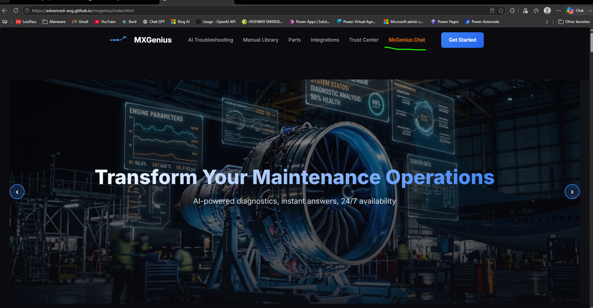
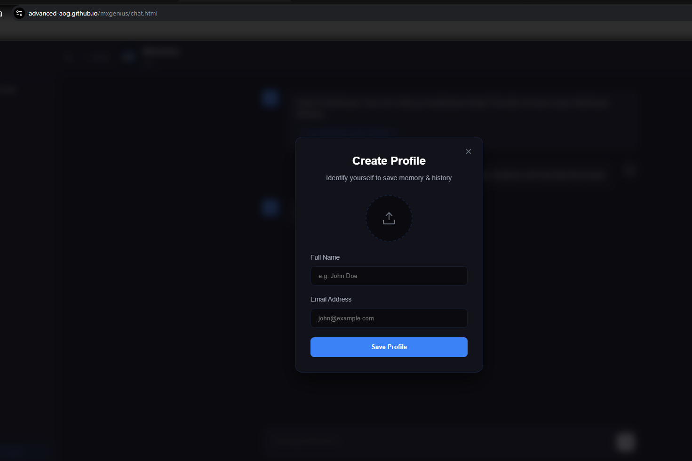
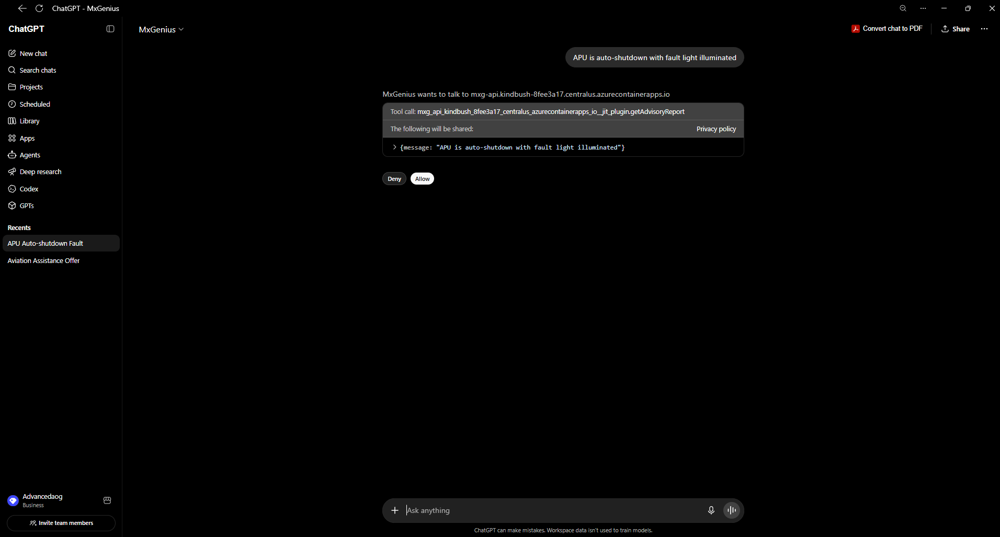
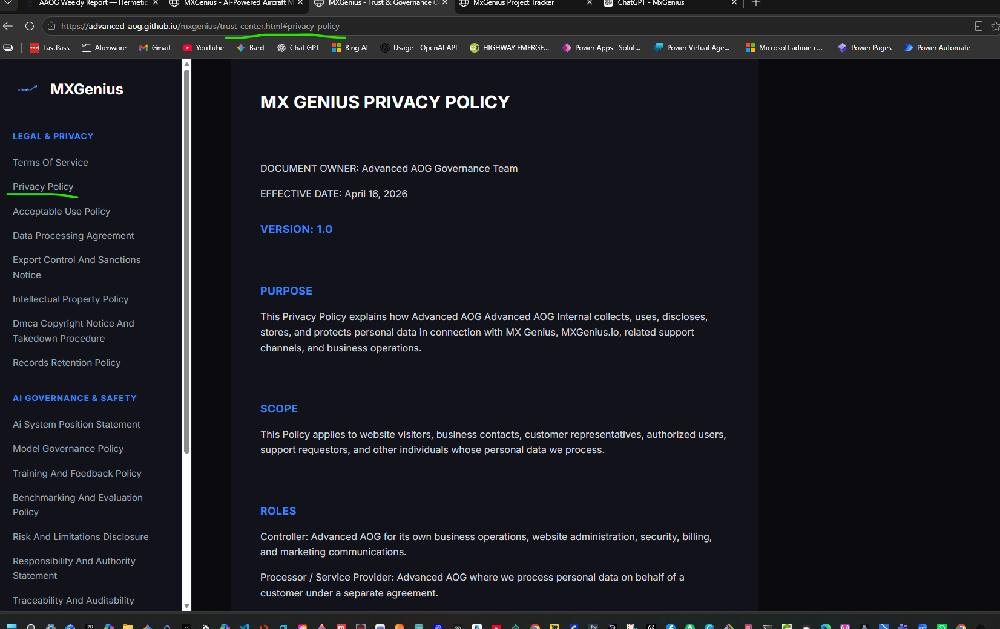
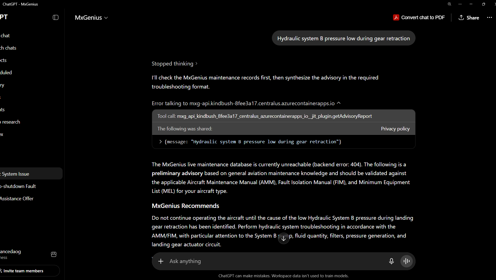
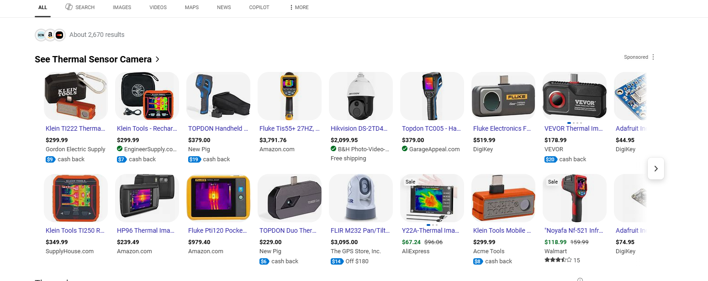

# Weekly Progress Report — Week 15
**Date Range:** Jun 22, 2026 — Jun 28, 2026
**Project:** Advanced AOG · Hermetic Labs

---

## advanced-aog.github.io

*Added a new tab here that replaced the training grounds that leads to the chat. This site still needs work with actual aviation-specific data that would replace the template.*

## website chat

*I currently have the API running in a sandbox, so you can't use it on the public site for obvious reasons. I'll let you guys know as soon as it's up and ready. I also should ask when we should use the actual MXGenius.io for the website, say the word and i'll connect the dns*

## Sandbox flow

*One of the things I'm hardening now is profiles, storage security, recall, just to be sure that it works at an enterprise level out the gate.*

## [https://chatgpt.com/g/g-6a429ffc124081918858168d19260045-mxgenius](https://chatgpt.com/g/g-6a429ffc124081918858168d19260045-mxgenius)

*Having an OpenAI business account and API also makes you eligible to create proper GPTs on their platform. So we have an MX Genius GPT under the Advanced AOG company that can connect to the API that I'm building on their platform, which gives you the closed loop.*

## Privacy

*Open ai needs a pravacy page*

## Trust center

*We used the one set up in trustcenter*

## Gpt Graceful failure and features

*this opens us up to everything and closes us to nothing.  We now have the full power of open ai.. in the coming weeks i plan on moving to the other major platforms as well so users don't have to choose*

## thermal sensors

*this ones straight forward, get the hardware, create the mount, encode the middle ware... devil will be in the details but i'll keep you posted.  This is the feature that will force us into ar/vr/xr/mr.   I'll keep you posted on progress*

---

*Prepared by Hermetic Labs for Advanced AOG*
